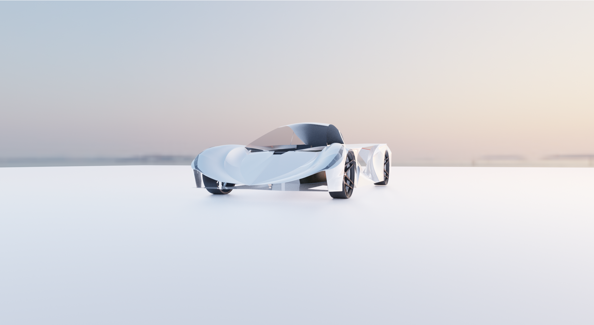

 The image represents Dio's initial form. Dio's [latest visual form exists within the "omni_automobil" category, as coined by God Bennett](https://www.behance.net/gallery/125296657/OmniAutomobil-Concept-Aria-Dio-2060-Esterno-Solare).

This shall serve as a main resource for all of [Dio](https://www.behance.net/gallery/113934681/World-1st-supercar-with-windshield-air-vents-Aria-Dio)'s Ai research related experiments.

i. Main Website: [fb.com/TheAriaDio](fb.com/TheAriaDio)

ii. Select youtube gta iv integration/gameplay before Dio included interior: https://youtu.be/iGprZYAJwas

iii. Behance: https://www.behance.net/gallery/113934681/World-1st-supercar-with-windshield-air-vents-Aria-Dio

1.) Artificial intelligence generated car interior
============

Although Dio's [current 3d interior](https://github.com/g0dEngineer/Dio-Le-Automobile-Ai-Research/blob/main/images/0_another_shot_CYCLES_FRONT.png) was crafted by hand, by God Bennett, experiments have also been done using Generative Adversarial Neural Networks.

See God's prior repository with old name prior to legal name change: [WORLDS-FIRST-OPEN-SOURCE-AI-CAR-INTERIOR-DESIGNER](https://github.com/JordanMicahBennett/WORLDS-FIRST-OPEN-SOURCE-AI-CAR-INTERIOR-DESIGNER)

2.) Image generated artificial engine sound generator: Image of supercar (Aria Dio) converted to Engine sounds (Work in Progress)
============

1) Imagining Aria Dio as an electric supercar, I quickly put together this image based engine sound audio demo. Engine sounds are generated from a picture of Aria Dio.

2) Using mostly harmonic/sound based methods as starting points, some electric car manufacturers are experimenting with engine sounds for quiet evs, as this can help to notify separate motorists of the operating conditions of the electric car. (Sample: https://www.hindawi.com/journals/sv/2018/5209207/)

3) Below I consider a reasonably novel/simple starting method, i.e. starting from an actual picture of my AriaDio supercar concept, and synthesizing engine sounds from there:

This generates a type of signature engine sound, based literally on the car's appearance.
============

https://github.com/g0dEngineer/Dio-Le-Automobile-Ai-Research/tree/main/module_2

## Latest artificial Dio Engine sound:

V2: https://github.com/g0dEngineer/Dio-Le-Automobile-Ai-Research/blob/main/module_2/v2_SOURCE_CODE_Aria%20Dio%20Artificial%20Engine%20Sound.zip

V3: https://github.com/g0dEngineer/Dio-Le-Automobile-Ai-Research/blob/main/module_2/v3_SOURCE_CODE_Aria%20Dio%20Artificial%20Engine%20Sound.zip

3.) Artificial Intelligence Vehicle Sketch to Paint Converter
============

Handrawn input/sample by God Bennett:

God's input automatically painted:

The future of automated/Ai based car design is exciting, even seeing my simple experiment below.

Configuring and using an open source Artificial Intelligence library for auto painting (that was not explicitly trained on car painting), I somewhat quickly experimented with vehicle painting/shading.

Results were surprising, the Ai being able to shade/paint sketches of vehicles, in seconds, without seeming to have been trained explicitly on the task of shading/painting vehicles.

https://github.com/g0dEngineer/Dio-Le-Automobile-Ai-Research/blob/main/module%203/README.md
