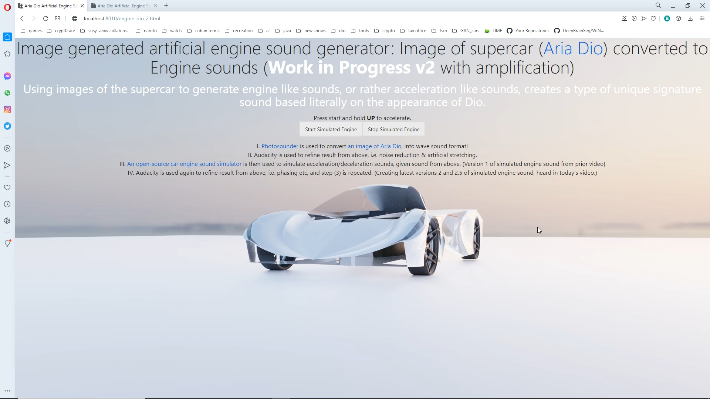

This shall serve as a main resource for all of [Dio](https://www.behance.net/gallery/113934681/World-1st-supercar-with-windshield-air-vents-Aria-Dio)'s Ai research related experiments.

i. Main Website: [fb.com/TheAriaDio](fb.com/TheAriaDio)

ii. Select youtube gta iv integration/gameplay before Dio included interior: https://youtu.be/iGprZYAJwas

iii. Behance: https://www.behance.net/gallery/113934681/World-1st-supercar-with-windshield-air-vents-Aria-Dio

1.) Artificial intelligence generated car interior
============

Although Dio's [current 3d interior](https://github.com/g0dEngineer/Dio-Le-Automobile-Ai-Research/blob/main/images/0_another_shot_CYCLES_FRONT.png) was crafted by hand, by God Bennett, experiments have also been done using Generative Adversarial Neural Networks.

See God's prior repository with old name prior to legal name change: [WORLDS-FIRST-OPEN-SOURCE-AI-CAR-INTERIOR-DESIGNER](https://github.com/JordanMicahBennett/WORLDS-FIRST-OPEN-SOURCE-AI-CAR-INTERIOR-DESIGNER)

2.) Image generated artificial engine sound generator: Image of supercar (Aria Dio) converted to Engine sounds (Work in Progress)
============

Imagining Aria Dio as an electric supercar, I quickly hashed together this image based engine sound audio demo. Engine sounds are generated from a picture of Aria Dio.

https://github.com/g0dEngineer/Dio-Le-Automobile-Ai-Research/tree/main/module_2

## Screenshot

## Video

https://github.com/g0dEngineer/Dio-Le-Automobile-Ai-Research/blob/main/module_2/video_.mp4
